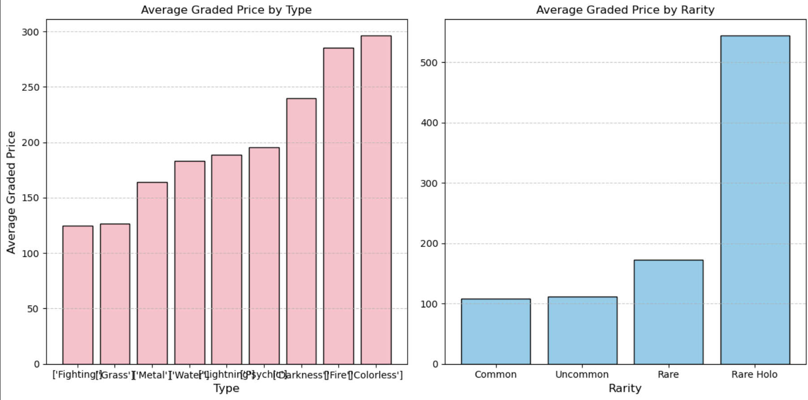
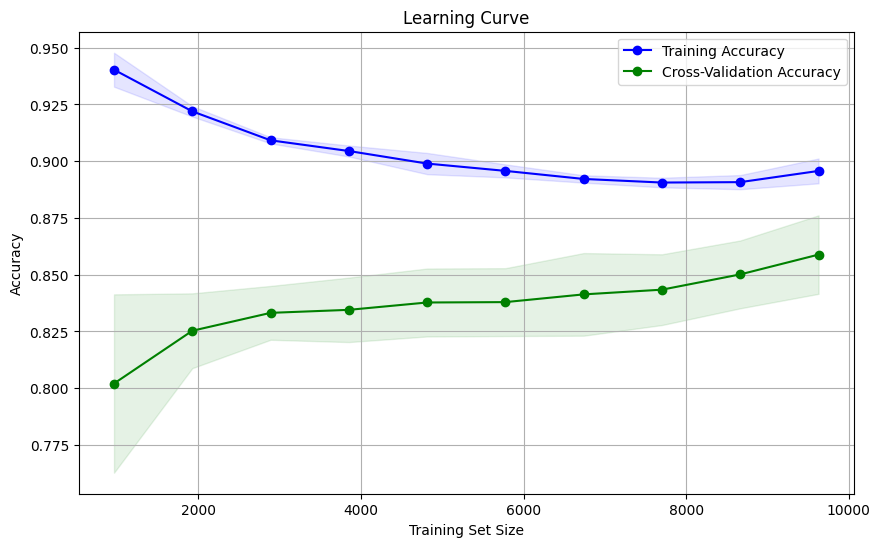
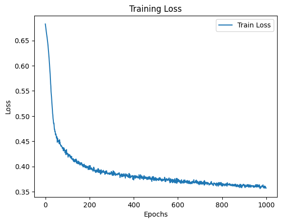
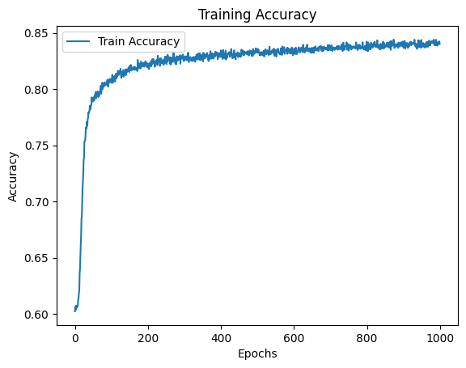

# CSE151A Pokemon Card Project
Building a machine learning model around Pokemon card prices and rarity

# Introduction

The Pokemon card market has experienced a dramatic surge in popularity, especially following the COVID-19 pandemic. What started as a children’s trading card game has transformed into a high-stakes collectors’ market, where rare and legendary cards can sell for hundreds of thousands of dollars. The rise of professional grading companies, which certify card quality and condition, has further fueled the demand, creating a competitive marketplace with unprecedented prices. 

This topic was chosen because of the group’s shared passion for Pokemon and the need for reliable, data-driven tools in this rapidly growing, multi-million-dollar industry. Pokemon universally appeals to generations of people, making this an exciting and relatable subject, as even enthusiasts like Professor Solares would agree (we think). While traditional methods—such as relying on anecdotal evidence, historical data, or recent transactions of a similar card and quality—can provide some guidance, they often result in inefficiencies and inaccuracies, leading to undervalued or overpriced cards. As the market continues to expand, a more sophisticated and structured approach to evaluating card rarity and market value is essential.

To address this need, this study incorporates several advanced machine learning techniques to predict the rarity of Pokemon cards based on features such as grade quality, statistics (i.e. Health Points, Evolution state, Move Damage), and visual features (i.e. regular, holographic, reverse holographic). Predictive models include random forest classifiers and neural networks, designed to identify relationships between card characteristics, rarity, and pricing trends. This study also explores broader market trends from 2021 onward, using methods like linear regression and neural networks to identify key factors influencing Pokemon card prices.

This topic is particularly cool because it combines a popular hobby and machine learning techniques. Pokemon card collecting has evolved into a sophisticated and lucrative global market, and by enabling accurate predictions of card rarity and value, this research enhances the collecting experience while promoting fair pricing and informed decision-making. Data-driven predictions have the potential to stabilize and bring more transparency to the Pokemon card marketplace.
The broader impacts of this research extend beyond the Pokemon card market, providing a foundation for improving valuation in other collectible industries. By replacing reliance on anecdotal evidence and word-of-mouth pricing with machine learning models, this study ensures greater transparency and efficiency in high-value markets. As these models evolve, they may soon become integral to future pricing techniques, influencing buyers and sellers with reliable data to make informed decisions. This approach ensures market stability and promotes a sustainable, equitable framework for collectibles industries worldwide. 


# Methods


## Data Gathering
Our data was collected by combining two datasets. One was scraped by using a price charting API. The other dataset was pulled from a Kaggle Pokemon dataset. ​​One problem we encountered was a disparity in ID systems between the two datasets. After some analysis of the ID names and their set names, it seemed like most of the datasets had a conversion by using their set name combined with an en dash(“-”) and their card number within the set. A few sets had to be ignored due to inconsistent naming. Although before we had around 50,000 observations, after combining datasets we had a total of 30300 observations with 56 features.
This combination process was documented and is repeatable with the scripts in the repository.

(https://github.com/charvishukla/cse151a-pokemon-project/tree/Milestone4/merge-scripts
)[https://github.com/charvishukla/cse151a-pokemon-project/tree/Milestone4/merge-scripts
]

After collecting our data, we becan exploring trends in it to inform our hypotheses better for the models to follow. Here is one example:




## Preprocessing
For our categorical data, we used `value_counts()` to quickly comb through columns of our chosen features to pick out which categories would be difficult to map due to the extremely low population. For example, all of the dual-typed cards were dropped due to very low counts compared to the rest of the types. After looking through `rarity`, `types`, and `generation` and their value counts, the feature counts containing less than the following were dropped.

```
thresholds = {
    'types': 1000  ,
    'rarity': 1000  ,
    'generation': 1500
}
for col, threshold in thresholds.items():
    counts = subset_df[col].value_counts()
    valid_categories = counts[counts >= threshold].index
    subset_df = subset_df[subset_df[col].isin(valid_categories)]
```

In addition, we created the following correlation heatmap to analyze the relationships between key features in our dataset, such as `card prices`, `sales volume`, and `health points (HP)`. The plot helps us identify strongly correlated variables, such as the high interdependence between different pricing metrics (e.g., `loose-price`, `graded-price`, `box-only-price`). Conversely, it reveals weak correlations, such as between `sales volume`, suggesting these may have _less_ predictive power for card valuation or rarity. This analysis informs our feature selection process by highlighting which variables are most meaningful for our models and which may need further investigation or exclusion. Ultimately, the heatmap provides critical insights for optimizing the performance and efficiency of our machine learning models.


### Removing Outliers 

Further preprocessing was required during tuning and reevaluation of our model 1 as well. After analyzing our pair plots, we attempted to drop some detail in our data as well as our output classes to make achieving a higher accuracy more plausible. We noticed that extremely high costs of a few cards were seen in our pairplots, causing the x-axes to stretch further than the others, which led us to believe high-cost cards were throwing our models off. Therefore we decided to drop the top 1% quartile of prices. 

The following is what our pair plot looked like **without** removing the outliers:


As for dropping detail, after coloring pair plots by rarity, it became evident that many of the previous 4 different rarity classes were overlapping in qualities, so much so that it would just be more useful to merge a few of the classes. This overlap is likely due to the idea that generally cards seem to be in a more binary category for either rare, being very high price (cards worth more than around a dollar) or lower price (only worth cents). Since rarity is categorical but still ordered, we were able to group common, uncommon, rare, and rare holos into common combined with uncommon and rare combined with rare holos. This is not unexpected due to the idea that rare holo and holo are essentially the same cards statistically, other than an added shiny visual effect.

Furthermore, we explored how features like pricing and conditions related across card collections and informed the model-building process, and choosing our input/output variables. The figure below visualized the pairwise relationships between numerical features in the dataset, categorized by the top three most common Pokémon card sets: Pokémon Promo, Silver Tempest, and Unbroken Bonds. Each point in the scatter plots represented a card, and the colors differentiated cards from these three sets. The diagonal tells us te variability within a set. 


### Merging output classes


```
top1 = subset_df['graded-price'].quantile(0.99)
subset_df = subset_df[subset_df['graded-price'] < top1]

subset_df['rarity'] = subset_df['rarity'].replace('Common', "Common/Uncommon")
subset_df['rarity'] = subset_df['rarity'].replace('Uncommon', "Common/Uncommon")

subset_df['rarity'] = subset_df['rarity'].replace('Rare', "Rare/Rare Holo")
subset_df['rarity'] = subset_df['rarity'].replace('Rare Holo', "Rare/Rare Holo")

```


### Dropping Null values
```
subset_df = subset_df.dropna()
```

encoded_df = pd.get_dummies(subset_df, columns=['types', 'generation'], drop_first=True)

## Model 1
The first model used random forest as an expedition into tree based algorithms as this was chosen before deciding to merge classes. After observing patterns in our data for some time, the non-linear, complex patterns that were difficult to pin down seemed like a good candidate for random forest classification. There were a few problems that came from this model initially, like accuracy, however biggest factor was the high overfitting indicated by 100% training set accuracy compared to a validation and test accuracy in the 60s. Due to time limitations, the model was not fully fixed until a later milestone, which addressed much of the overfitting problems, tuned hyperparameters and merged classes for increased accuracy. At the same time, we found that increasing n_estimators up from a default of 100, to 220 allowed us to increase accuracy while keeping our training accuracy close to testing and cross validation accuracy.

Tuning manually, we found most of the default parameters for the RandomForestClassifier to be optimized. Of the hyperparameters changed, the most impactful for reducing overfitting was decreasing `max_depth` to 10. The default `max_depth` is set to 30, which essentially captures less details per tree in our data allowing for higher generalization in our model. With a few iterations, we found that reducing it past 10 began to seriously become detrimental to the accuracy of our model, so 10 was set as our optimal hyperparameter. `min_samples_split` was also slightly changed to a default of 2 to 4 for a very minimal boost in accuracy. `ccp_alpha`, `max features` and `min_samples_leaf` made little difference or negative impact to change so we left them at their default values and finished our tuning.


Tuning results can be seen below as text file outputs using loops as this was done before learning of search tuning. 
[https://github.com/charvishukla/cse151a-pokemon-project/tree/Milestone4/reduce-overfit-tuning](https://github.com/charvishukla/cse151a-pokemon-project/tree/Milestone4/reduce-overfit-tuning
)
### Resampling
Lastly, to handle for sampling imbalance, we used SMOTE with the default setting of minority class resampling.

## Model 2
For our second model we decided on a Neural Network to predict the rarity of Pokemon cards based on both categorical and numerical features. We used One Hot encoding to encode our categorical data as well as Standardized our numerical data to prevent any feature from dominating during learning. After processing the data we ended with 21 features and 12631 rows. For our hyperparameters we used binary cross-entropy loss due to our target feature, rarity, being able to be represented in binary format. Some of the hyperparameters that we tuned were the learning rate, ultimately decided on 0.001 and our optimization method, ending with Stochastic Gradient Descent.

Due to the fact that we had some issues with overfitting with the last model, for this model we applied a dropout on 30% of the working neurons to prevent the network from over-specializing on specific neurons, this process is found in this line: `self.dropout1 = nn.Dropout(0.3)`. Finally, we trained our model for 1000 epochs to make it converge as seen with the Training and Testing Accuracy Graphs
[https://github.com/charvishukla/cse151a-pokemon-project/blob/Milestone4/Milestone4-Second-Model.ipynb](https://github.com/charvishukla/cse151a-pokemon-project/blob/Milestone4/Milestone4-Second-Model.ipynb)


# Results


Initially, the model exhibited overfitting, with 100% training accuracy but only 67% testing accuracy. This large gap indicated that the model was memorizing the training data instead of generalizing well to unseen data.

To address this:
The number of trees `n_estimators` was increased to 220.
The maximum depth of the trees `max_depth` was limited to 10.
The minimum samples required to split a node `min_samples_split` was set to 4.

These changes encouraged the model to better generalize to unseen data by limiting its complexity and avoiding overfitting patterns in the training model. As a result:
Training Accuracy was reduced to 0.895, closer to the testing accuracy.
Testing Accuracy improved to 0.841, indicating better generalization.


## Model 1: Random Forest

The following classification report summarizes the performance of Model 1.
1. Accuracy (0.84): The model correctly predicts the rarity of Pokémon cards 84% of the time. The performance is slightly better for the `Common/Uncommon` class (precision, recall and F1 score of 0.87) compared to the `Rare/Rare Holo` class (precision, recall and F1 score of 0.80) 
2. Macro Average: Precision, Recall, F1-Score (0.83). This indicates that the model treats both classes fairly equally. 
3. Weighted Average: Precision, Recall, F1-Score (0.84). This shows that there is consistency with the overall dataset distribution.

Here is the terminal output for the classification report:

```                 
 precision    recall  f1-score   support

Common/Uncommon       0.87      0.86      0.87      1510
 Rare/Rare Holo       0.80      0.80      0.80      1018

       accuracy                           0.84      2528
      macro avg       0.83      0.83      0.83      2528
   weighted avg       0.84      0.84      0.84      2528


```
The following is our learning curve (after preventing and adjusting for overfitting):




## Model 2: Neural Network.
We see the trajectory of the neural net's training accuracy over epochs to be over 80%, settling at around 84% which is near the testing accuracy of also around 84%. This gives an indication that overfitting is not a large problem at play for our model.

At the beginning of training, the loss is initially very high, but begins to sharply decrease for around ~50 epochs. Past this, for 100 epochs, a transition to a plateauing shape can be observed which can be interpreted as a sort of "fitting". Furthermore, the longer the training goes, we do not see an increase in loss besides noise, rather, a slow decline. This indicates that the model is fitting the data rather than overfitting which may be indicated by an increasing loss after fitting. 

The following are our diagrams for **training accuracy** and **training loss:**




Compared to the previous model, the main differential is the difficulty in fitting. To reduce the overfitting problem from before required tuning the number of trees in our forest in `n_estimators` as well as artificially limiting the depth of our trees with `max_depth` to better capture generality rather than capture specific patterns in our training data. Other hyperparameters were tested but were found to decrease overall accuracy.


The neural net does a similar adjustment process automatically for weights during training, which made the fitting more natural for the model and required comparatively little manual adjustment on parameters.
Here are the results from our confusion matrix:

**Correct Predictions (Accuracy)**: 3177
**False Positives (FP)**: 270
**False Negatives (FN)**: 343


# Discussion


# Conclusion
In the beginning, we started with a dataset containing about 30300 observations and 56. This dataset resulted from merging two separate datasets, of which one was scraped using an API. Throughout this project, we were only able to utilize a small subset of this dataset’s features as many features proved irrelevant after processing. We built a Random Forest and a simple Neural Network to predict the rarity of a Pokemon Card, based on a combination of categorical and numerical variables. The results from our Random Forest and Neural Network was as follows:


The models of our choice — although powerful and simple — were only able to handle a small subset of our features, given the amount of data. Thus, in the future, to tackle such complexity, we aim to work with Ensemble Models. These models would employ a combination of Machine Learning algorithms instead of just one, leading to greater predictive power and generalizability.

There are many different possible routes we wanted our project to extend to. We realized in the time that we were allotted for this project that we would only be able to predict Pokemon Card rarity based on our selected features. In the future, we would like to create models that can accomplish other tasks within the Pokemon Card market space. This includes models that could predict the price of a card or the possible grade a card may receive based on a provided image of said card. We also worked a lot with models focused on classification for this project. Though classification was productive in our case, there is a case that can be made that choosing a different model for finance related data could help improve our accuracies further. However, we were able to build a high accuracy model with classification for the task we aimed for.

We are definitely not the first group of people to ever build a functional machine learning model to predict characteristics of a Pokemon Card. Many researchers and students have created successful models that accurately predict factors such as price and rarity. In fact, research has shown that there are some models that are more accurate at grading cards than trained professionals hired at grading companies. Despite this, the adoption of machine learning in the Pokemon Card market is still something that is heavily debated. Sellers and buyers in the market prefer the opinion of authorized graders over machine learning models that are created by researchers. Even if the grading of a card is more subjective overall with a human due to bias, many individuals still choose to accept the opinion of the elite rather than algorithms trained with statistical data. As a result, machine learning may need more of an introduction to the community as a tool for our benefit. As models become more accurate and further research is done on Pokemon Cards, we believe the legitimacy of machine learning in the market will be extremely beneficial. Therefore, the research we have done serves a purpose greater than just obtaining a grade for the class. It provides a means of objectivity in a market where everyone is trying to prove the worth of their own Pokemon Card collections.

# Statement of Collaboration

Charvi Shukla:  

Pedro Arias: 

David Kim: 

Kenneth Song: Team member/writer: Introduction writeup portion, organized writeup figures to use, set up meetings, double checked work before submissions, communicated often with group

George Li:

Anthony Georgis: 

