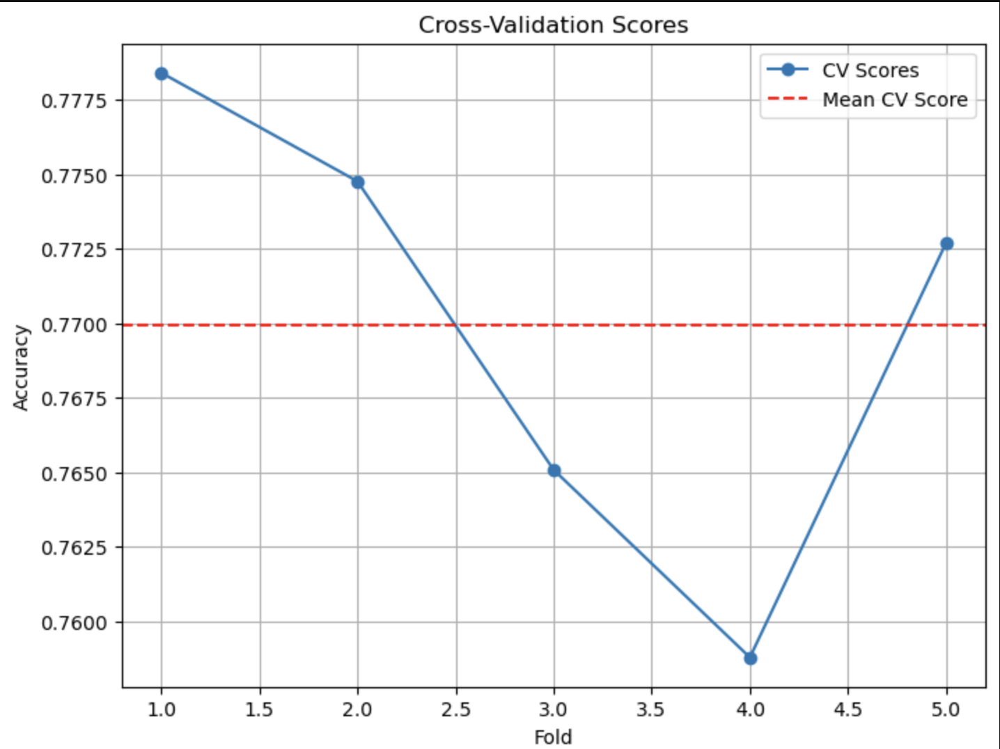
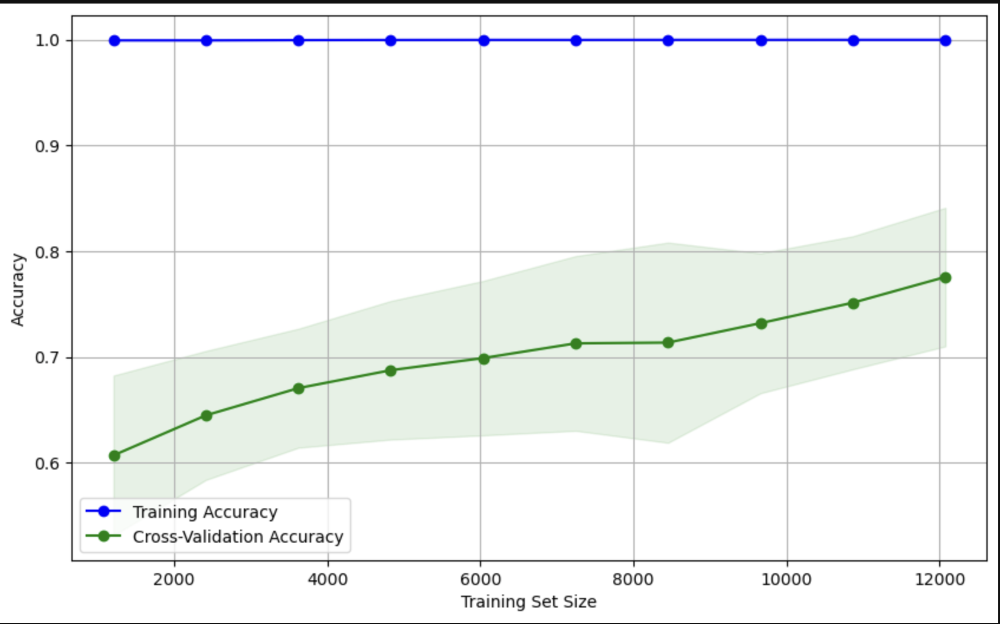

# cse151a-pokemon-project
Building Machine learning models around Pokemon card prices and attributes

## Dataset Retrieval
Our data was scraped using the [Price charting API](https://www.pricecharting.com/api-documentation). Initially, we had $60296$ observations with $27$ features. The second dataset we used was the [Pokemon Cards dataset from Kaggle](https://www.kaggle.com/datasets/adampq/pokemon-tcg-all-cards-1999-2023/data). We combined both of these datasets, and the resulting dataset has $30300$ observations with $56$ features. We dropped columns with a really high number of null values, and also irrelevant colunns that we thought were un-informative to our study. The remaining features are listed below. The code for the same can be found in our `cse151a_pokemon_project_exploration.ipynb` file

## Dataset download and Environmment set-up instructions:
**Dataset Download** -
1. The Pokemon Cards Data can be downloaded form Kaggle by following this link: https://www.kaggle.com/datasets/adampq/pokemon-tcg-all-cards-1999-2023/data
2. The Price Charting Data was extracted using a paid API, which is stored in a private google drive found here: https://ucsdcloud-my.sharepoint.com/:f:/g/personal/cshukla_ucsd_edu/EiksPRBMWu1AsIEoCJaYNPcBaycdRswLyPCJO9FwLywatQ?e=5TOFP8

For this project, please download and add these `.csv` files in the root directory of the project. 

**Environment Set-up**:
We have used the following Python Libraries:
- `pandas`
- `seaborn`
- `numpy`
- `scipy`
- `matplotlib`

This repository can be cloned using the following command:

```
https://github.com/charvishukla/cse151a-pokemon-project.git
```
---

## Feature Description

The code can either be run locally using Jupyter Notebook (`cd cse151a-pokemon-project; jupyter-notebook`) or can be uploaded and run on Google Collab. 

We have the following features in `price-guide.csv` file:

1. `id` - The unique identifier for the specific Pokémon Card labeled by Price Charting       
2. `console-name` - The name of the collection (set) that the Pokémon Card was released in
3. `product-name` - The name of the Pokémon Card
4. `loose-price` - The price of the Pokémon Card without any grade
5. `graded-price` - The price of the Pokémon Card graded at a 9
6. `box-only-price` - The price of the Pokémon Card graded at a 9.5
7. `manual-only-price` - The price of the Pokémon Card graded at a 10 by PSA
8. `bgs-10-price` - The price of the Pokémon Card graded at a 10 by BGS
9. `condition-17-price` - The price of the card when graded at a 10 by CGC
10. `condition-18-price` - The price of the card when graded at a 10 by SGC
11. `retail-loose-buy` - Price recommended by Price Charting to buy the Pokémon Card at without any grade
12. `retail-loose-sell` - Price recommended by Price Charting to sell the Pokémon Card at without any grade   
13. `sales-volume` - Yearly units sold
14. `tcg-id` - ID of the Pokémon Card in its specific set
15. `release-date` - Date of when the Pokémon Card was released
16. `tcg_id` - Pokémon TCG API English Card ID
17. `set` - card sequence num in the current set
18. `series` - card's series name
19. `publisher` - card's publisher (For example, WOTC = Wizards of the Coast, TPCI = The Pokémon Company International)
20. `generation` - card's generation (numerical equivalent of series)
21. `release_date` - card release date
22. `artist` - The card's artist 
23. `name` - The name of the Pokémon Card (according to the TCG dataset)
24. `set_num` - card sequence num in the current set
25. `types` - card type(s) (Example: colorless, psychic, lightning, metal etc)
26. `supertype` - card supertype (Pokémon, Trainer, Energy)
27. `subtypes` - ard's subtype(s) 
28. `hp` -  card's hit points
29. `weaknesses` - card's weaknesses (i.e. what type is our current pokemon the weakest against)
30. `rarity` - The rarity of the Pokemon Card (not pokemon)
31. `legalities` - The legalities of the pokemon card
32. `resistances`-  The resistances listed on the Pokemon Card 

---
# Milestone 3:

(Note: all preprocessing code and model code can be found in our github repository: https://github.com/charvishukla/cse151a-pokemon-project/blob/Milestone3/Milestone3-Preprocessing-Model1.ipynb)

## Preprocessing:

We began Milestone 3 by finishing the major preprocessing we had yet to do from milestone 2.
We did the following:
- Dropped null rows from the merged dataset from MS2
- Dropping categories with very few observations for certian categories:
  - We used a threshold to fix the minimum number of observations each category needs to have. We used the following theresholds:
       - `types`: 1000     
       - `rarity`: 1000  
       - `generation`:1500
- One-Hot Encoding for categorical variables `type` and `generation`


---
## Model 1: Random Forest
In this model, we are using a **Random Forest Classifier** to predict the **rarity** of Pokemon cards based on a combination of numerical as well as categorical features.

#### Features :
1. **Categorical Features**:
   - `types`: Represents the type/category of the item.
   - `generation`: Refers to the generation or version of the item.

2. **Numerical Features**:
   - `bgs-10-price`: The graded price of the item in mint condition.
   - `graded-price`: The general graded price of the item.
   - `hp`: Represents the item's hit points (a measure of power or health).
   - `sales-volume`: Indicates the volume of sales for the item.

3.  Target Variable :
- **rarity**: The classification label indicating how rare the item is.

We decided to use price as one of our features after analyzing its relationship with rarity and type. Here is the graph 


 
### Steps 
#### Address class imbalance using `SMOTE (Synthetic Minority Oversampling Technique)`

#### Cross Validation using `K-fold` from `sklearn`:
- Split the data into 5 folds for training and validation.
- We train and evaluate model on different subsets of the data to prevent overfitting
- Following are the training accuracies for each fold:
``` [0.77840344 0.77475985 0.76507621 0.75878065 0.77269715]```

The trend in the training accuracy across folds can be seen below:



## Training vs Testing Error:

Our training accuracy was at 99% while our testing accuracy was at 67%. This leaves us with a gap of about 32% between the two sets. This can indicate that our model is overfitting based off of our training data, and we may need to adjust our training and testing splits as well as consider adding a validation set to ensure that we have an accurate accuracy for both of our data sets. The training set had near perfect precision and recall which definitely does indicate overfitting and we will aim to address this in future models.

Here is a diagram of our curve:
The trend in the training accuracy across folds can be seen below:



## Interpreting The Fitting Graph:

After plotting our model predictions for our training and testing splits, we can see that there is a large gap between the testing curve and training curve. The training curve does not move while our testing curve has an upward trend as our training set size increases. Due to this large gap, this definitely means that we have a problem with overfitting our data.

## Testing Set Evaluation:
The following are our results from evaluating on the testing set:

#### Classification Report
1. **Accuracy (0.67)**:
   - The model correctly predicts the rarity of Pokémon cards **67% of the time**.
2. **Macro Average**:
   - **Precision, Recall, F1-Score (0.64)**:
3. **Weighted Average**:
   - **Precision, Recall, F1-Score (0.67)**:

```
              precision    recall  f1-score   support

      Common       0.83      0.85      0.84       892
        Rare       0.54      0.52      0.53       609
   Rare Holo       0.63      0.64      0.64       470
    Uncommon       0.58      0.57      0.58       581

    accuracy                           0.67      2552
   macro avg       0.64      0.64      0.64      2552
weighted avg       0.67      0.67      0.67      2552


```

The accuracy of our testing set was 66.97% indicating that our model was accurately able to predict a card's rarity based on the price of the card at about 67% accuracy. For the common cards, we had a balanced performance with high precision and recall at 83% and 85% respectively. For our rare and uncommon cards, the model struggled a bit more with precision and recall for rare cards being 54% and 52% respectively and for uncommon cards being 57% and 58%. Since our recall and precision are lower for these card rarities, this can indicate that there might be a class imbalance or that the features we chose are not relevant enough. We believe that it might not be because of class imbalance though because we chose to resample the data before fitting it into our model.


#### Confusion matrix:

1. **Common**:
   - Most are correctly predicted (756), but some are misclassified as `Uncommon `(91) or other classes.
   - The model performs best on `Common` cards because they dominate the dataset and are easier to distinguish.

2. **Rare**:
   - 316 are correctly predicted, but many are confused with `Rare Holo` (119) and `Uncommon` (125).
   - This suggests the model struggles with finer distinctions between "Rare" and similar classes.

3. **Rare Holo**:
   - 300 are correctly predicted, but a significant number are misclassified as "Rare" (125).
   - This confusion is likely due to overlapping features between "Rare Holo" and "Rare."

4. **Uncommon**:
   - 334 are correctly identified, but there is confusion with `Common` (91) and "Rare" (116).
   - This indicates the model has difficulty separating `Uncommon` from other classes.

```
[[756  30  15  91]
 [ 49 316 119 125]
 [ 18 125 300  27]
 [ 91 116  40 334]]
```


## Next Model Considerations:

For the next models we want to consider, we want to create more classification models for our data in the form of logistic regression, and we'd also like to use a linear regression model to predict the price based on our features as well. For further classification models, we will look to use decision trees due to their ability to handle null values. This gives us more flexibility with our datasets and should even help us with overfitting. Before we start on these next models though, we would like to adjust some of the data for our random forest model as we believe we can prevent overfitting by adjusting the training and testing splits while also adding a validation set. We would like to revisit this random forest model and improve upon it as we continue to create new models for our data.

## Conclusion

For our first model, we have concluded that we are overfitting our model based on the results we have gathered. With an accuracy of 67% on our testing predictions, we are happy with the result as it is our first model. However, we cannot take this as necessarily the correct accuracy because of our overfitting problem and we will explore this in the future. We will improve this model by introducing a validation set and adjusting the splits between the sets as well. We would also like to take a look at the features to ensure we are including relevant features that will help us have a higher accuracy with our predictions. We may also take a look at class imbalance and improve our issue with it further by using class weights.

# Milestone 4

## Addressing Overfit in Milestone 3
Our training accuracy over time showed 100% training accuracy, while having testing accuracy of around 67%. This large disparity was pointed out to be fixed before comparison to our second model.

To address this, we adjusted hyperparameters and changed our output classes to increase accuracy as well as make our training accuracy approach our testing/validation accuracy.

After changes:

Ending training accuracy after cross validation = 0.895

Testing accuracy = 0.841

```
                 precision    recall  f1-score   support

Common/Uncommon       0.87      0.86      0.87      1510
 Rare/Rare Holo       0.80      0.80      0.80      1018

       accuracy                           0.84      2528
      macro avg       0.83      0.83      0.83      2528
   weighted avg       0.84      0.84      0.84      2528
```


## Preprocessing:
After receiving feedback on overfitting issues on our previous model and looking to improve our model accuracy, a few output classes were merged to better align with real world classifications that are often made about pokemon cards.

Following up on the preprocessing done in milestone 3, we pregrouped the cards:

Common and Uncommon cards were grouped together as uncommon cards are have very little statistical and qualitative difference from Common crads

Rare and Holo Rare cards were grouped together due to many holo rares being an identical copy of a rare, with no statistical differences, just visual differences(added shine to the card).

## Model 2: Perceptron Neural Net
Same as model 2, we are predicting the **rarity** of Pokemon cards based on the same features listed below.
**Categorical Features**:
   - `types`: Represents the type/category of the item.
   - `generation`: Refers to the generation or version of the item.

**Numerical Features**:
   - `bgs-10-price`: The graded price of the item in mint condition.
   - `graded-price`: The general graded price of the item.
   - `hp`: Represents the item's hit points (a measure of power or health).
   - `sales-volume`: Indicates the volume of sales for the item.

Target Variable :
- **rarity**: The classification label indicating how rare the item is.

## Training vs Testing Accuracy
We see the trajectory of the neural net's training accuracy over epochs to be over 80%, settling at around 84% which is near the testing accuracy of also around 84%. This gives an indications that overfitting is not a large problem at play for our model.


### Where does your model fit in the fitting graph?


At the beginning of training, the loss is initially very high, but begins to sharply decrease for around ~50 epochs. Past this, for 100 epochs, a transition to a plateuing shape can be observed which can be interpreted as a sort of "fitting". Furthermore, the longer the training goes, we do not see an increase in loss besides noise, rather, a slow decline. This indicates that the model is fitting the data rather than overfitting which may be indiciated by an increasing loss after fitting.

### What are the next models you are thinking of and why?
A few thoughts on models to try next were possibly a convolutional neural network to try to work with the image data that we have. Because we now have a clearer divide in output classes, it may be easier to try an image based input as a feature. Although not explored yet, an SVM is also another idea for classification, although we feel as though it may be difficult and will definitely be a non-linear kernel due to highly variant features.

## Predictions of correct FP and FN
From the sklearn's `confusion_matrix()` function with inputs `y_true, y_pred` gives the output:

```
[[1997  270]
 [ 343 1180]]
```

Where the shape corresponds to:

```
[[TP FP]
[FN TN]]
```
Therefore:
* Correct = TP + TN = 1997 + 1180 = 3177
* FP = 270
* FN = 343

## Conclusion

### What is the conclusion of your 2nd model?

### What can be done to possibly improve it?
